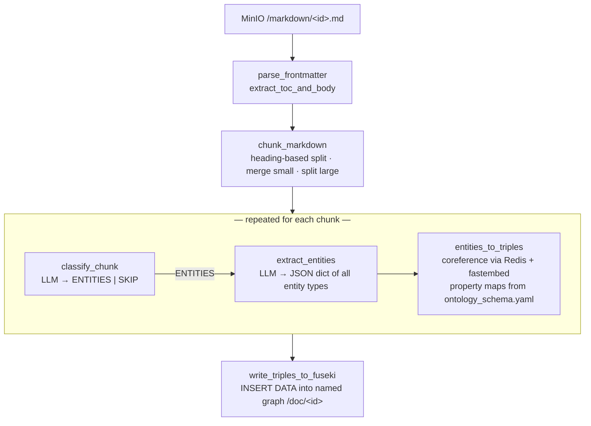

# graph_worker

Converts campaign-setting PDFs (already extracted to Markdown by the pdf_worker) into
RDF triples in Fuseki. It runs as a poll loop, claiming documents from a shared Redis
state machine and writing to a TDB2 named graph per document.

## Pipeline at a glance



The graph_worker polls **Redis** for documents in a claimable state, then downloads the
Markdown from MinIO. It does not poll MinIO directly.

## Module responsibilities

### `main.py` — orchestration and state machine

Runs `poll_loop()`, which scans Redis for documents in any claimable state and calls
`process_markdown()` for each one it can atomically lock.

**Redis state machine per document** (key `doc:<id>:state`):

```
MARKDOWN_READY
  → CLASSIFYING_SECTIONS
  → EXTRACTING_ENTITIES
  → MAPPING_TO_ONTOLOGY
  → LOADING_GRAPH
  → COMPLETED  /  FAILED
```

Any state except COMPLETED and FAILED is claimable, so a document abandoned by a
crashed worker is automatically restarted from chunk 0 by any live worker that picks it
up next.

**Lock protocol:**  
`doc:<id>:lock` is a Redis key set with `NX PX <LOCK_TTL_MS>`. After each chunk,
`refresh_lock()` extends the TTL so the lock survives slow LLM calls. Release uses a
Lua script to guard against releasing a lock owned by a different worker.

**Debug output:**  
When `CHUNK_DIR` is set, each chunk is written to `<CHUNK_DIR>/<id>/<n>_<slug>.json`
with its text, section metadata, and classifier label. A `manifest.json` summarises
totals. Useful for diagnosing chunking or classifier behaviour without re-running
the full pipeline.

### `chunker.py` — semantic Markdown chunker

`MarkdownChunker` takes a Markdown string (with YAML front matter) and returns a list
of chunks, each with text and a metadata dict.

**Two-pass algorithm:**

*Pass 1 — classify every line:*

| kind | how detected |
|------|-------------|
| `page_marker` | `<!-- page: N -->` comment |
| `footer` | bold/bare page numbers (`**42**`, `42`), "Chapter N \| …" footers |
| `heading` | ATX `# …`, bold-only `**Title**`, italic-only `_Title_` lines |
| `body` | everything else |

Prose-detection heuristics prevent bold lead-in sentences ("**She ran** toward the
door.") from being mistaken for headings.

*Pass 2 — walk classified lines and emit chunks:*  
A `_flush()` call emits the accumulated body under the current heading. Heading level
is tracked in a `hierarchy` dict so each chunk can carry its full ancestor path.

**Post-processing:**
- `_merge_small_chunks` — chunks below `min_chunk_tokens` are appended to the
  previous chunk if it fits within the budget.
- `_split_large_chunks` — chunks above `max_chunk_tokens` are split at paragraph
  (`\n\n`) boundaries.

Token budget: `max_chunk_tokens = context_window * 3/4 - 700`. The 700-token overhead
covers the extractor system prompt, known-entities hint, and output.

### `extractor.py` — LLM interface

Two public functions, both thin wrappers around `litellm.completion`:

- **`classify_chunk(text)`** — returns `"ENTITIES"` or `"SKIP"`. Sends 5 tokens
  max; anything containing "ENTITIES" in the response is treated as ENTITIES.

- **`extract_entities(text, known_entities)`** — returns a dict keyed by `llm_key`
  (e.g. `"npcs"`, `"locations"`) with lists of extracted entity dicts. Sends the
  full system prompt and up to `context_window / 4` output tokens.

**YAML-driven prompt:**  
`_build_extractor_system()` constructs the system prompt by iterating
`entity_types[*].llm_schema` from `ontology_schema.yaml`. Each entity type's schema
is serialised as a JSON example. Classifier notes (e.g. "psionic abilities → skills")
are appended from `entity_types[*].notes`.

**LLM config:**  
Read from `LLM_CONFIG_PATH` (`/config/llm.yaml`). `${VAR}` tokens are substituted
from the environment at load time. Falls back to `LLAMA_CPP_HOST` / `LLM_MODEL` env
vars if the file is absent. All fields except `model` are passed as kwargs to litellm,
so any litellm-supported provider parameter (timeout, temperature, api_key, …) works.

**JSON recovery:**  
The extractor strips markdown code fences before parsing. On `JSONDecodeError` it logs
a warning and returns `_EMPTY_EXTRACTION` (all arrays empty) so the pipeline continues.

### `mapper.py` — entity-to-triple converter and coreference resolver

**`entities_to_triples(r, entities, yaml_meta, page_ref)`**  
Iterates `entity_types` from the ontology YAML. For each type with a `llm_key`,
calls `_entity_triples()` for every extracted entity.

**`_entity_triples(r, entity, book_uri, page_refs, type_name, type_def)`**  
Fully YAML-driven. Reads seven property map sections from the entity type definition:

| YAML key | behaviour |
|----------|-----------|
| `datatype_properties` | scalar field → `cs:prop "value"` |
| `list_datatype_properties` | list field → one literal triple per element |
| `object_properties` | scalar field → `cs:prop <uri>` (creates URI via Redis) |
| `list_object_properties` | list field → one URI triple per element |
| `reverse_object_properties` | `<target_uri> cs:prop <current_uri>` (e.g. parent contains child, leader leaderOf faction) |
| `symmetric_object_properties` | writes both directions |
| `relationship_types` | dispatch table for the `relationships` array: each entry has `type`, `target`, and a YAML-defined `{property, symmetric}` |

**`_resolve_class(entity, type_def)`**  
Handles three subtype styles from the YAML:

- *String value* (Location, Faction): `subtypes: {City: City}` → `(City, [Location])`
- *Dict with parents* (Item): `subtypes: {Attire: {class: Attire, parents: [WondrousItem, MagicItem, Item]}}` → `(Attire, [WondrousItem, MagicItem, Item])`
- *No match* → `default_subtype` if present (Item fallback to MagicItem), else `uri_suffix` with no extras.

**Coreference resolution:**  
`_get_or_create_uri(r, name)` checks Redis for an existing URI slug. On a miss it
computes a `nomic-ai/nomic-embed-text-v1.5` embedding and compares cosine similarity
against up to 200 existing entities:

- ≥ `auto_merge_threshold` (default 0.92): silently reuse the existing URI.
- ≥ `review_threshold` (default 0.80): create a new URI but add the name to
  `review:entity_names` in Redis.

The fastembed model is downloaded into the image at build time
(`RUN python -c "from fastembed import TextEmbedding; ..."`) so containers can start
offline.

**`write_triples_to_fuseki(document_id, triples)`**  
All triples collected during the run are written in a single
`INSERT DATA { GRAPH <http://campaignsetting.io/doc/<id>> { … } }` call. Using a
named graph per document makes it possible to drop and re-ingest a single document
without touching others.

## Configuration

| Env var | Default | Purpose |
|---------|---------|---------|
| `FUSEKI_ENDPOINT` | `http://localhost:3030/campaign` | Fuseki dataset URL |
| `FUSEKI_USER` / `FUSEKI_PASSWORD` | `admin` / `""` | Fuseki basic auth |
| `REDIS_URL` | `redis://localhost:6379` | State machine and coreference index |
| `MINIO_ENDPOINT` | `http://localhost:9000` | Object storage |
| `MINIO_ACCESS_KEY` / `MINIO_SECRET_KEY` | `minioadmin` | MinIO credentials |
| `ONTOLOGY_SCHEMA_PATH` | `/config/ontology_schema.yaml` | Entity types, property maps, LLM schema |
| `LLM_CONFIG_PATH` | `/config/llm.yaml` | LLM provider, model, timeout |
| `INGESTION_CONFIG_PATH` | `/config/ingestion_config.yaml` | Coreference thresholds |
| `LOCK_TTL_SECONDS` | `300` | Lock expiry; extend per-chunk |
| `POLL_INTERVAL_SECONDS` | `10` | Sleep between Redis scans |
| `CONTEXT_WINDOW` | `4096` | Chunk and output token budget |
| `CHUNK_DIR` | `/chunks` | Debug chunk output (leave empty to disable) |

## Extending the ontology

To add a new entity type that the LLM extracts:

1. Add an entry to `queryable_types` in `config/ontology_schema.yaml` (so it
   appears in the MCP server's `list_entities`).
2. Add an entry to `entity_types` with `llm_key`, `llm_schema`, and the relevant
   property maps (`datatype_properties`, `object_properties`, etc.).
3. That's it — no Python changes.

To add a new field to an existing type:
add one line to the right property map in that type's `entity_types` entry.

To add a new relationship traversable via `get_relationships`:
add an entry to `relationship_properties`.

To add a new `search_by_property` filter:
add a property name to `allowed_filter_properties`.
